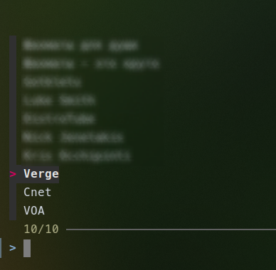
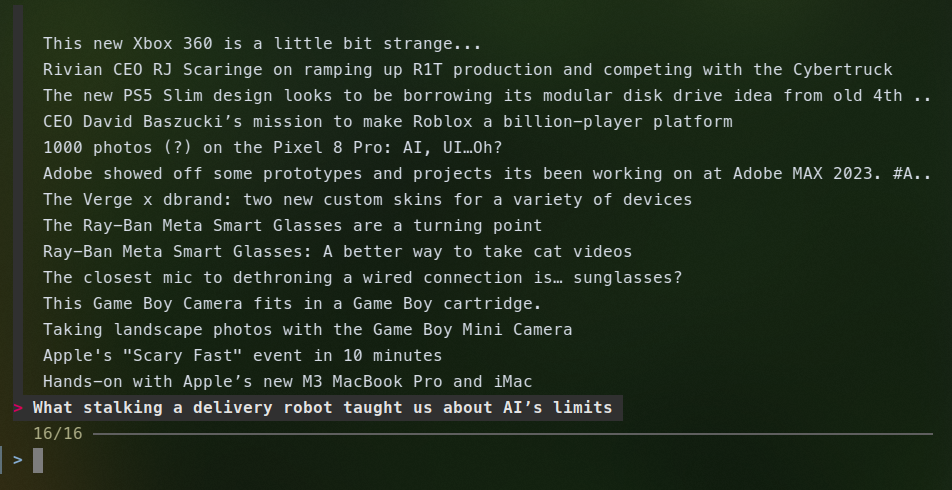
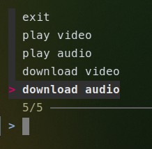

# yt-mpv
yt-mpv is a bash script to play, download video and audio from YouTube

(requirements: [yt-dlp](https://github.com/yt-dlp/yt-dlp), [mpv](https://mpv.io/))

## Step 1

By default yt-mpv starts with three "example channels". They are not blured on the screenshot bellow.

You can find out channel ids of your favorite channels and add them to the script as you please.

## Step 2

Use arrow-keys to choose or type part of the channel name. Menues are fzf powered and will help you narrow choice options.

Press "Enter" to choose a channel and you yt-mpv will give you the latest titles, that were published.

If there's something, that you would like to watch, listen or download, choose it.

## Step 3

Now you can choose what to do with the content.

- download audio
- download video
- play audio
- play video
- or exit

BTW you can exit anytime from yt-mpv by pressing CTRL+C

and start it again to choose another content.

If you like the script and find it useful, consider giving it a star, please.
